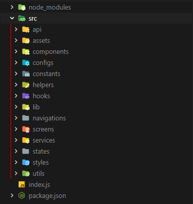

# react-native-project-setup

Accelerate your React Native project setup with this CLI tool designed to streamline the creation of a meticulously organized project directory. By automating the establishment of essential folders and files, this tool adheres to industry-standard React Native project conventions, saving you valuable time and effort during initialization. Whether you're starting a new project or enhancing an existing one, simplify your workflow and maintain consistency across your applications effortlessly.

[](https://www.npmjs.com/package/react-native-project-setup)    [](https://nodejs.org/en/)


# Demo :movie_camera:



## Installation

Using npm:

```bash
npm install react-native-project-setup

```
Using yarn:

```bash
yarn add react-native-project-setup

```

## Usage

```javascript
rn-setup create
// Once installed globally, you can use the CLI by running the following command in your terminal:

```

## Contributing

Pull requests are welcome. For major changes, please open an issue first
to discuss what you would like to change.

Please make sure to update tests as appropriate.

## License

[Apache 2.0](https://www.apache.org/licenses/LICENSE-2.0.txt)